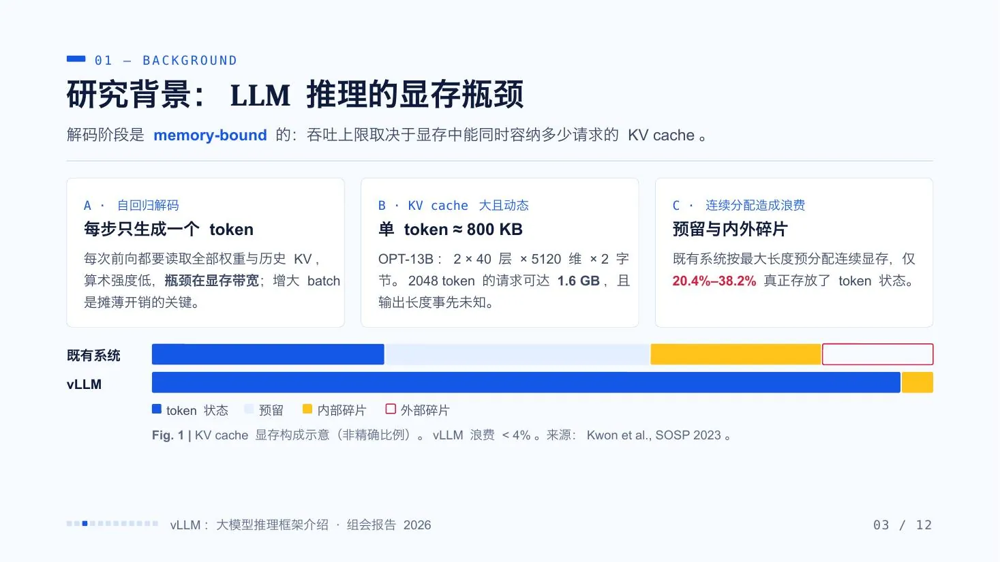
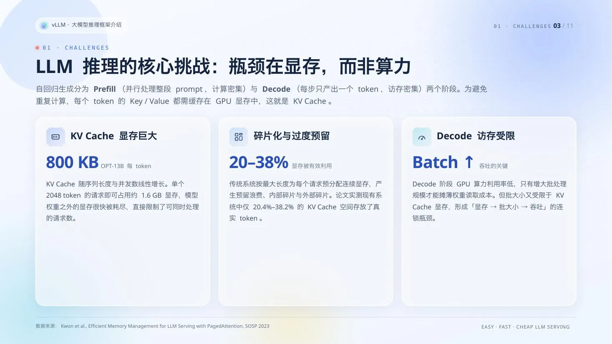
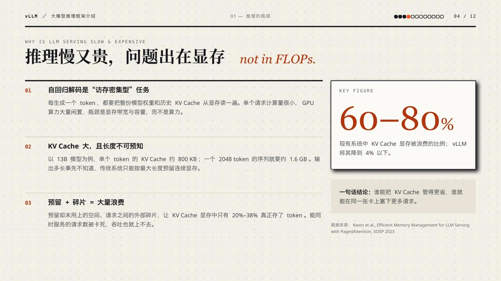
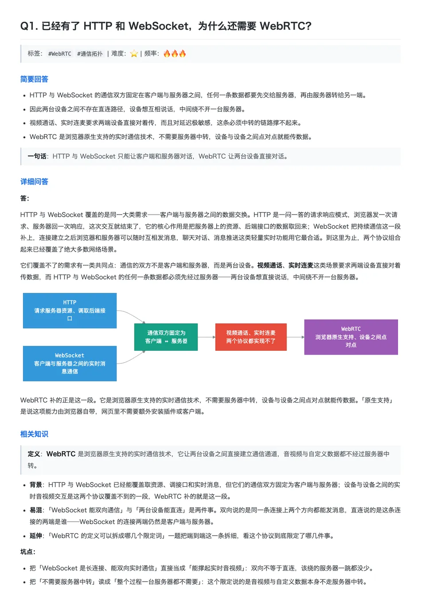

<p align="center">
  
  
  
  <a href="https://linux.do"></a>
</p>

# bili-2-ppt

把一条 B 站视频做成三份可以直接用的学习资料：**学习笔记PPT、知识博客文章、八股模拟面试**。

核心目标是**真正看画面**。视频里出现过的代码、命令、报错、表结构和框图会被原样抓下来，配在对应的讲解旁边；字幕里没有的内容，不靠猜。

> 基于 [Rimagination/bili-note](https://github.com/Rimagination/bili-note) 二次开发。


## 一、功能说明

输入一条 B 站视频的链接，输出以下产物： 

| 交付物 | 用途 |
| --- | --- |
| 学习笔记PPT | 梳理大纲，快速预览学习：分步展开，点一下多一块 |
| 知识博客文章 | 从头来细致学习整体内容：按知识点和概念编排的章节式长文 |
| 八股模拟面试 | 深扣细节，找出理解上的不足：每题分「简要回答 / 详细问答 / 相关知识」三段 |

知识博客文章和八股模拟面试是两个内置的 **Markdown 模版**，可以按同样的方式加自己的模版，见「使用」。

PPT 一次交两个版本，方便对照检查重绘有没有读错内容：

- **图片版**：截图原样嵌入PPT页面；
- **图形版**：每处画面尝试按内容重绘成原生矢量形状、文字和表格。


## 二、工作流程


四个阶段，只跑你需要的那几个，已有产物直接复用：

- **字幕资料**（[bili-subtitle-asr](bili-subtitle-asr/SKILL.md)）：先找现成字幕，再取公共字幕和网页 AI 字幕，都没有才提音频跑本地 ASR；
- **画面采集**（[bili-keyframes](bili-keyframes/SKILL.md)）：后台浏览器按进度条跳转采样，去重，标出画面覆盖不足的区间；
- **知识树与画面分派**（[bili-knowledge-tree](bili-knowledge-tree/SKILL.md)）：立知识树、统一术语，把每张画面派到它对应的知识点。这一步只产出中间清单，不出文档；
- **三份交付物**（[bili-document-builder](bili-document-builder/SKILL.md) + [bili-pptx](bili-pptx/SKILL.md)）：编排分页与并行转写，建 PPT、注入动画、渲染自检。

转写是唯一并行的环节，默认分 5 批；其余阶段串行。


### 画面采集来源

1. **后台跑**：浏览器开在屏幕外，不抢前台焦点，你该干嘛干嘛；优先复用本机已登录 B 站的浏览器实例，不再单开一个未登录的干净实例。
2. **按进度条跳转**：加载播放器后直接跳到采样时间，不等整段视频播完。
4. **去重后再补采**：一个知识点在画面上停留十几分钟会采出十几张重复图，去重是默认环节，连续重复的保留最后一帧——那才是定格完整的一张。去重后仍覆盖不足的区间，局部补采再重新去重。


## 三、目录结构

```text
bili-2-ppt/
├── SKILL.md                  上层调度入口：需求澄清、阶段路由、交接与验收
├── bili-subtitle-asr/        阶段 1：字幕获取、音频提取与分段 ASR
├── bili-keyframes/           阶段 2：画面采集、去重、补采样提示
├── bili-knowledge-tree/      阶段 3：立知识树、把画面分派到各知识点（中间环节）
├── bili-document-builder/    阶段 4：按 Markdown 模版产出文档，并编排 PPT 分页转写
│   └── references/templates/ Markdown 模版：每个模版一个目录，含 描述.md + 案例.md
├── bili-pptx/                阶段 4：读模版、建页、注入动画、校验与渲染自检
├── references/               共享契约：禁用词表、mermaid 配色
└── scripts/                  跨阶段共用脚本：浏览器会话、CDP 执行、Markdown 规范化、版式检查
```


## 四、案例

### PPT案例

内置三套 PPT 模版，成品 PPT 会从模版抽取设计语言（配色、字号层级、形状语言、版头版脚），版面按材料内容重新构图，不照搬原件的页面。

**Cryo_Academic（默认）**



**GlacierGlass**



**PagedDaylight**



### MD案例

每个 Markdown 模版自带一份参考案例：[知识博客文章](bili-document-builder/references/templates/知识博客文章/案例.md)、[八股模拟面试](bili-document-builder/references/templates/八股模拟面试/案例.md)。

八股模拟面试案例




## 五、安装、依赖和使用

### 安装

把这句话发给 Agent：

```text
请帮我安装这个 skill：
https://github.com/ewkzcz/bili-2-ppt
```

目录名保持 `bili-2-ppt`。子技能之间靠相对路径互相引用，改名会找不到彼此。


### 依赖环境

依赖按需分层，缺哪层就少一条路线，不影响其它部分：

| 能力 | 需要什么 |
| --- | --- |
| 基础提取 | Python 3.10+、能访问 B 站 |
| 网页 AI 字幕 | 已登录 B 站的 Chrome / Edge，或开着调试端口的浏览器实例 |
| 中文转写 | `ffmpeg` + Qwen3-ASR 环境 |
| 外语转写 | `ffmpeg` + Whisper / faster-whisper |
| 画面采集 | `websocket-client`、Pillow，以及一个能登录 B 站的浏览器 |
| PPT 生成与自检 | `python-pptx`、`lxml`、Pillow；自检还要 LibreOffice 和 poppler |


### 使用

```text
把这个视频做成学习资料：https://www.bilibili.com/video/BVxxxxxxxxxx
```

想加自己的 PPT 模版，把一对同名的 pptx 和 html 放进 `bili-pptx/references/` 即可。

想加自己的 Markdown 模版（比如「速查手册」），在 `bili-document-builder/references/templates/` 下建一个 `速查手册/` 目录，放进两份文档即可，不用改脚本：

- `描述.md`：格式定位描述，写这种文档的定位和格式规范，文件头 frontmatter 声明结构规则；
- `案例.md`：实际产物案例，一份按这个格式写好的成品。

照内置的两个模版抄一份改最省事。放好后在需求里点名要「速查手册」就会按它产出。


## 六、社区友链

- [LINUX DO](https://linux.do/)：一个关注开发者、开源项目与 AI 工具交流的社区。感谢社区佬友对开源工具和 Agent 工作流的讨论与反馈。


## 七、许可与致谢

MIT 协议，见 [LICENSE](LICENSE)。

本项目基于 [Rimagination/bili-note](https://github.com/Rimagination/bili-note) 二次开发。

原项目功能：「公共字幕 → 网页 AI 字幕 → 本地 ASR」；

本项目新增功能：画面采集、去重、知识树、文档编排和 PPT 生成。

请遵守平台条款与著作权规定，仅用于个人学习和已获授权的材料。


