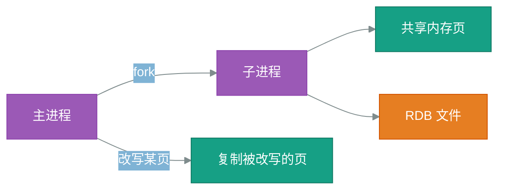

# Redis 持久化 八股模拟面试
Redis 把数据放在内存里，读写快，但进程一退出内存就清空。持久化要解决的是怎样把内存数据落到磁盘，重启后还能恢复。

核心矛盾在于「落盘越勤，数据越安全，性能越差」，RDB、AOF 与混合持久化是三种不同的取舍。


## RDB 快照

### Q1. RDB 的 BGSAVE 是怎么做到不阻塞主线程的？
> 标签：`#RDB` `#fork` | 难度：⭐⭐ | 频率：🔥🔥🔥

#### 简要回答
- `BGSAVE` 会 fork 出子进程，由子进程写 RDB 文件，主进程继续处理请求；
- 子进程靠**写时复制**共享父进程内存，不需要先拷一整份数据；
- 真正会阻塞的只有 fork 那一下，实例越大，fork 越慢。

> **一句话**：fork 子进程写盘，写时复制省内存，只有 fork 瞬间会卡。


#### 详细问答
**答：**

`BGSAVE` 的执行分三步：

1. 主进程调用 fork，复制页表，得到子进程；
2. 子进程遍历内存，把数据序列化成 RDB 文件写到临时文件，写完后原子替换旧文件；
3. 主进程在此期间照常处理命令，改写某个内存页时，内核才复制那一页。



额外内存取决于快照期间被改写的页比例 $r$，约为 $r \cdot M$（$M$ 为实例内存）。写入越密集，峰值越接近两倍内存。

**追问：**

**Q：** `SAVE` 和 `BGSAVE` 有什么区别？
**A：** `SAVE` 在主线程里直接写盘，写完之前所有请求都被阻塞；线上只用 `BGSAVE`。


#### 相关知识
> **定义**：**写时复制**（Copy-on-Write）是父子进程先共享内存页，只有某一方改写时才复制被改写那一页的机制。

- **背景**：fork 如果真的复制全部内存，大实例会卡住很久，写时复制把代价推迟到「真的被改写时」；
- **易混**：fork 本身仍要复制页表，页表大小与内存成正比，所以大实例的 fork 依旧会有明显停顿；
- **延伸**：开启大页内存后，改写一个字节也要复制整个大页，写时复制的开销会被放大。

**坑点：**

- 机器内存只够一份数据时，写入密集的实例在快照期间可能触发 OOM。


### Q2. RDB 的自动触发条件怎么配置？
> 标签：`#RDB` `#配置` | 难度：⭐ | 频率：🔥🔥

#### 简要回答
- 用 `save <秒> <修改次数>` 声明，多条规则是「或」的关系，任一满足就触发 `BGSAVE`；
- 条件越密，丢数据的窗口越小，fork 越频繁。


## AOF 与混合持久化

### Q1. AOF 的三种刷盘策略怎么选？
> 标签：`#AOF` `#appendfsync` | 难度：⭐⭐ | 频率：🔥🔥🔥

#### 简要回答
- `always`：每条命令都刷盘，最安全，吞吐最低；
- `everysec`：每秒刷一次，最多丢约 1 秒数据，默认也最常用；
- `no`：交给操作系统，最快，丢多少不可控。

> **一句话**：绝大多数场景选 `everysec`，拿一秒的丢失窗口换吞吐。


#### 详细问答
**答：**

| 策略 | 刷盘时机 | 最多丢失 | 吞吐 |
| --- | --- | --- | --- |
| `always` | 每条写命令后 | 几乎不丢 | 最低 |
| `everysec` | 后台线程每秒一次 | 约 1 秒 | 高 |
| `no` | 由内核决定 | 不可控 | 最高 |

```conf
# 每秒刷一次盘：刷盘在后台线程完成，主线程不被磁盘 IO 拖住
appendfsync everysec
```

**追问：**

**Q：** `everysec` 一定只丢 1 秒吗？
**A：** 不一定。上一次刷盘还没完成时，主线程会最多再等 1 秒才阻塞写入，极端情况下丢失接近 2 秒。


### Q2. 什么是混合持久化，它解决了什么问题？
> 标签：`#混合持久化` `#AOF重写` | 难度：⭐⭐ | 频率：🔥🔥

#### 简要回答
- AOF 重写时，文件前半段写成 RDB 格式快照，后半段追加重写期间的增量命令；
- 恢复时先加载快照、再重放少量命令，兼得 RDB 的加载速度和 AOF 的低丢失。


#### 相关知识
- **背景**：纯 AOF 恢复要逐条重放，数据量大时重启很慢；纯 RDB 又会丢掉上次快照之后的全部写入；
- **延伸**：混合持久化由 `aof-use-rdb-preamble yes` 开启，前提是 AOF 已经打开。
