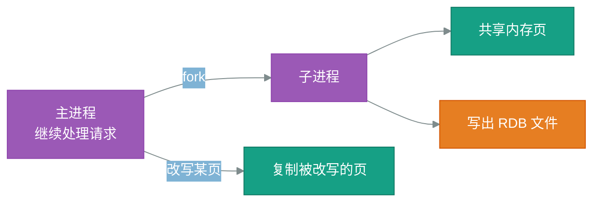

## Redis 持久化
Redis 把数据放在内存里，读写快，但进程一退出内存就清空。持久化要解决的就是：怎样把内存里的数据落到磁盘上，重启后还能恢复。

核心矛盾在于「落盘越勤，数据越安全，性能越差」。RDB 和 AOF 是两种取舍方向，混合持久化则试图兼得两者的长处。


### 一、为什么需要持久化

#### 1、内存数据的易失性
**易失性**说的是断电或进程退出后数据就没了。Redis 所有数据结构都常驻内存，不做持久化时，一次重启就等于清库。

对只当缓存用的场景，这可以接受——数据丢了再从数据库回源即可；但一旦 Redis 被当作主存储（计数器、排行榜、会话），丢数据就是事故。


#### 2、持久化的两条路线
落盘有两种思路：一种是定期把整份内存拍成快照，另一种是把每条写命令追加记下来，重启时重放。前者对应 **RDB**，后者对应 **AOF**。

| 维度 | RDB 快照 | AOF 追加日志 |
| --- | --- | --- |
| 记录内容 | 某一刻的完整数据 | 每一条写命令 |
| 恢复速度 | 快，直接加载 | 慢，逐条重放 |
| 最多丢失 | 上次快照之后的全部写入 | 取决于刷盘策略，最少约 1 秒 |
| 文件体积 | 紧凑的二进制 | 随命令增长，需要重写压缩 |


### 二、RDB 快照

#### 1、fork 与写时复制
**fork** 是操作系统复制出一个子进程的系统调用。Redis 执行 `BGSAVE` 时 fork 出子进程，由子进程把内存写成 RDB 文件，主进程继续处理请求。

子进程并不会立刻复制一整份内存，而是靠**写时复制**（Copy-on-Write）：父子进程先共享同一批内存页，只有某一页被主进程改写时才复制那一页。



写时复制带来的额外内存，取决于快照期间被改写的页数。设被改写的比例为 $r$、实例内存为 $M$，额外占用约为 $r \cdot M$，写入越密集，峰值越接近两倍内存。


#### 2、触发条件的配置
快照可以手动触发，也可以按「多长时间内发生多少次修改」自动触发：

```conf
# 900 秒内至少 1 次修改就做一次快照
save 900 1
# 300 秒内至少 10 次修改
save 300 10
# 快照失败时拒绝写入，避免在无法落盘的状态下继续接收数据
stop-writes-on-bgsave-error yes
```

规则之间是「或」的关系，任意一条满足就触发。条件定得越密，丢数据的窗口越小，但 fork 越频繁。


### 三、AOF 追加日志

#### 1、三种刷盘策略
AOF 把写命令先写进内核缓冲区，什么时候真正刷到磁盘由 `appendfsync` 决定：

```conf
# 每条命令都刷盘：最安全，吞吐最低
appendfsync always
# 每秒刷一次：最多丢约 1 秒数据，默认值
appendfsync everysec
# 交给操作系统决定：最快，丢多少不可控
appendfsync no
```

`everysec` 是大多数场景的折中：刷盘在后台线程完成，主线程不被磁盘 IO 拖住。


#### 2、AOF 重写
命令越记越多，同一个键被改一百次就有一百条记录。**AOF 重写**是按当前内存状态重新生成一份最短的命令序列，替换旧文件。

重写同样走 fork 子进程。重写期间的新命令会同时写进一块重写缓冲区，子进程完成后再追加到新文件末尾，保证不丢。


### 四、混合持久化与选型
Redis 4.0 引入**混合持久化**：AOF 重写时，文件前半段直接写成 RDB 格式的快照，后半段再追加重写期间的增量命令。恢复时先加载快照部分，再重放少量命令，兼得 RDB 的加载速度和 AOF 的低丢失。

选型可以按对丢失的容忍度来定：纯缓存关掉持久化或只开 RDB；允许丢一秒的业务开 AOF `everysec` 并启用混合持久化；一条都不能丢的数据，不该只靠 Redis 单机持久化来保证。
